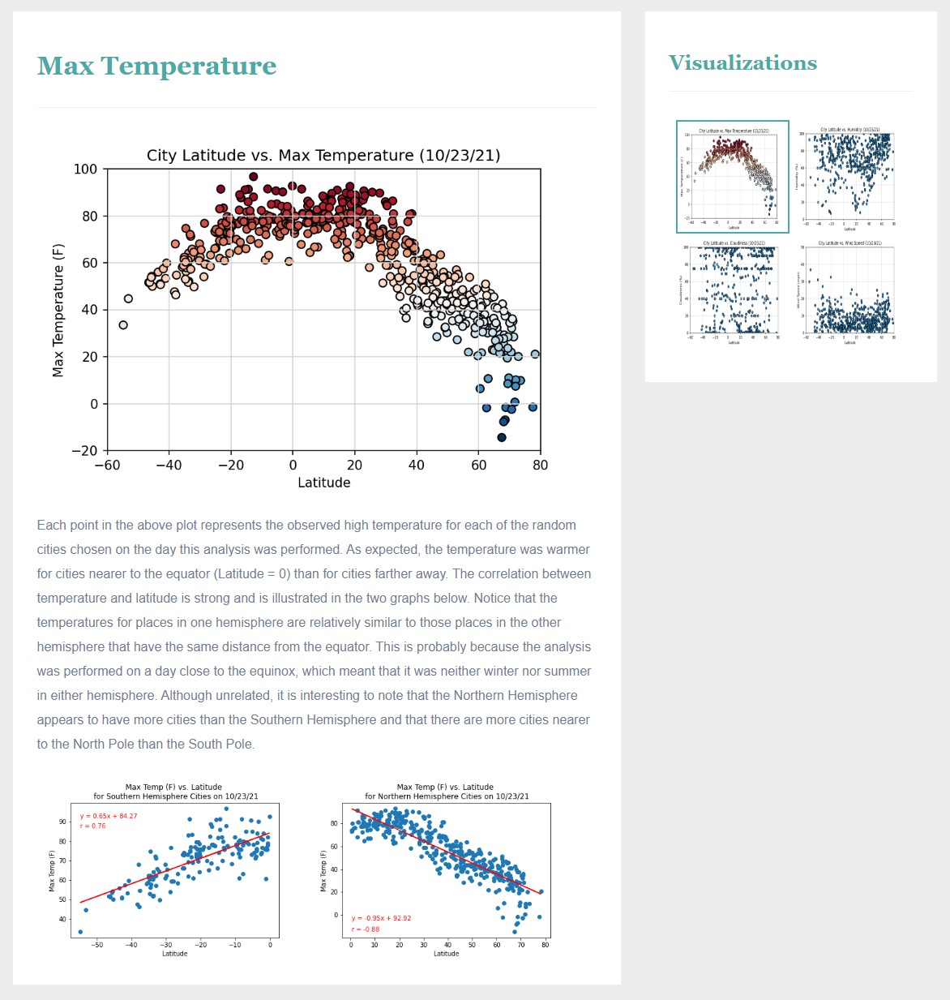
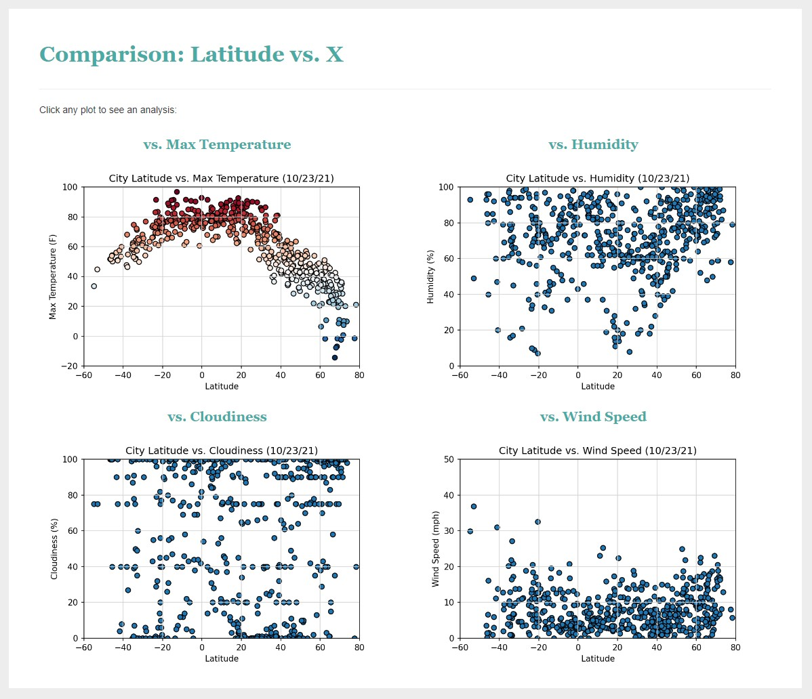
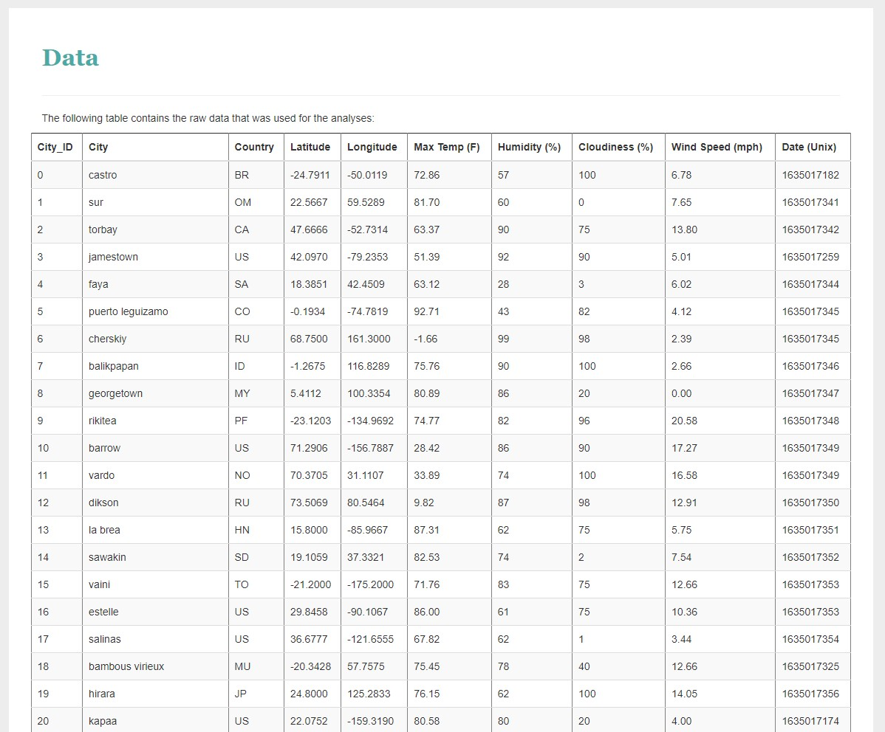

<h1> The Effects of Latitude on Weather   (HTML / CSS / Bootstrap Demonstration) </h1>

#### Overview:
The purpose of this project was to create a website that illustrates how weather in a location might be influenced by distance from the equator.
The website was built using HTML, CSS, the Bootstrap library, and static visualizations from a previous project that explored this topic: 
https://github.com/rickmora98/Python-API/

To see the results of the analysis, click on the deployed website link below.  
To examine the code files, their locations are indicated in the tree below.

#### Deployed website:
https://rickmora98.github.io/Web-Design-Challenge/

#### Folders/Files:
+ **"docs"** (this is the main folder which contains the website source code)  
	- *"index.html"* (landing page)  
	- *"temp.html"* (temperature analysis page)  
	- *"humidity.html"* (humidity analysis page)  
	- *"cloudiness.html"* (cloudiness analysis page)  
	- *"wind.html"* (wind speed analysis page)  
	- *"comparison.html"* (comparison snapshot page)  
	- *"data.html"* (data table page)  
	- **"css"** (folder containing the style sheets)  
	- **"data"** (folder containing the data table)  
	- **"images"** (folder containing all images used by the website)  
	
The deployed website relies on the folders and files and their relative locations within the **"docs"** folder as indicated above.  
(Please do not delete, move, rename, or alter!)

#### Temperature Analysis Page:
  

#### Visualization Comparison Page:
  

#### Data Table Page:
  
